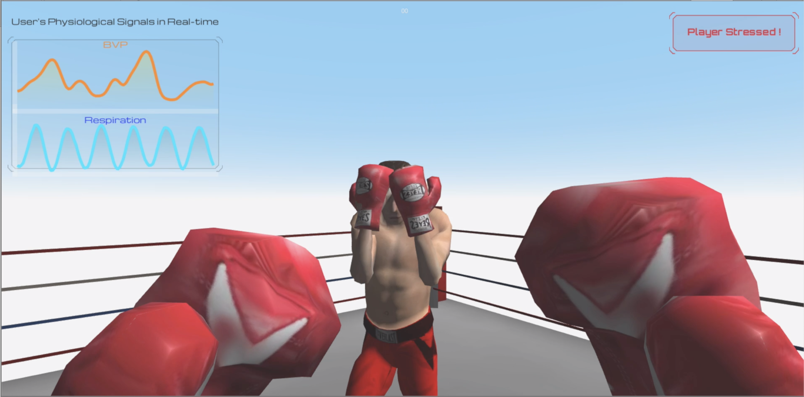

# VR Contents for Siggraph Asia 2019

*This is a Unity3d project contains three VR contesnts.(dummy demo)*
- 1.Difficulty Adustbale Horror Game 
- 2.Boxing Game with Respiration feedback 
- 3.Respiration Feedback Demo using Avatar

### Difficulty Adustbale Horror Game Example 

- HorroGame without Emotion Sensing

*Scene : Scenes/ZombieMain*
> ゾンビーを倒すFPSゲーム。マウスをクリックしてゾンビに発射、的中ならゾンビのHPが減る（Zombie_HP=10)ゾンビがPlayerのところに辿り着いたら攻撃を初める。ゾンビーに攻撃を受けるとPlauyerのHPは減る。PlayerのHPが0となるとゲームオーバー。銃の攻撃力は常に1.

- HorroGame with Emotion Sensing

*Scene : Scenes/ZombieMain_withEmotion*
> ゾンビーを倒すFPSゲーム。感情をリアルタイムでセンシング。感情がFearになる間、銃の攻撃力は100になる.

### Boxing Game with respiration feedback 

*Scene : Scenes/Boxing_withResp*

操作についで：
- 攻撃：R T F G （パンチ）
- 守る：E
- 移動：　↑ ↓ → ←

### Respiration Feedback using Avatar

*Scene : Scenes/VirtualResp*
>深呼吸、浅い呼吸をアバタで見せる

